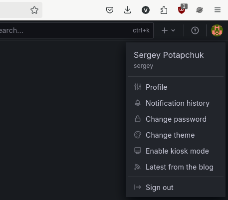

# Домашнее задание к занятию «Система мониторинга Prometheus». Потапчук Сергей

Это задание для самостоятельной отработки навыков и не предполагает обратной связи от преподавателя. Его выполнение не влияет на завершение модуля. Но мы рекомендуем его выполнить, чтобы закрепить полученные знания.

### Цели задания

1. Научиться устанавливать Prometheus
2. Научиться устанавливать Node Exporter
3. Научиться подключать Node Exporter к серверу Prometheus
4. Научиться устанавливать Grafana и интегрировать с Prometheus


### Чеклист готовности к домашнему заданию
- [ ] Просмотрите в личном кабинете занятие "Система мониторинга Prometheus" 

### Инструкция по выполнению домашнего задания

1. Сделайте fork [репозитория c шаблоном решения](https://github.com/netology-code/sys-pattern-homework) к себе в Github и переименуйте его по названию или номеру занятия, например, https://github.com/имя-вашего-репозитория/gitlab-hw или https://github.com/имя-вашего-репозитория/8-03-hw).
2. Выполните клонирование этого репозитория к себе на ПК с помощью команды `git clone`.
3. Выполните домашнее задание и заполните у себя локально этот файл README.md:
   - впишите вверху название занятия и ваши фамилию и имя;
   - в каждом задании добавьте решение в требуемом виде: текст/код/скриншоты/ссылка;
   - для корректного добавления скриншотов воспользуйтесь инструкцией [«Как вставить скриншот в шаблон с решением»](https://github.com/netology-code/sys-pattern-homework/blob/main/screen-instruction.md);
   - при оформлении используйте возможности языка разметки md. Коротко об этом можно посмотреть в [инструкции по MarkDown](https://github.com/netology-code/sys-pattern-homework/blob/main/md-instruction.md).
4. После завершения работы над домашним заданием сделайте коммит (`git commit -m "comment"`) и отправьте его на Github (`git push origin`).
5. В личном кабинете прикрепите ссылку на решение в виде md-файла в вашем Github.
6. Любые вопросы задавайте в чате учебной группы и/или в разделе «Вопросы по заданию» в личном кабинете.

---

### Задание 1
Установите Prometheus.

#### Процесс выполнения
1. Выполняя задание, сверяйтесь с процессом, отражённым в записи лекции
2. Создайте пользователя prometheus
3. Скачайте prometheus и в соответствии с лекцией разместите файлы в целевые директории
4. Создайте сервис как показано на уроке
5. Проверьте что prometheus запускается, останавливается, перезапускается и отображает статус с помощью systemctl

#### Требования к результату
- [ ] Прикрепите к файлу README.md скриншот systemctl status prometheus, где будет написано: prometheus.service — Prometheus Service Netology Lesson 9.4 — [Ваши ФИО]

### Решение

```
sudo useradd --no-create-home --shell /bin/false prometheus
sudo mkdir -p /etc/prometheus /var/lib/prometheus
wget https://github.com/prometheus/prometheus/releases/download/v3.4.1/prometheus-3.4.1.linux-amd64.tar.gz
tar -xvf prometheus-3.4.1.linux-amd64.tar.gz
sudo cp prometheus-3.4.1.linux-amd64/prometheus /usr/local/bin/
sudo cp prometheus-3.4.1.linux-amd64/promtool /usr/local/bin/
sudo cp prometheus-3.4.1.linux-amd64/prometheus.yml /etc/prometheus/
sudo chown -R prometheus:prometheus /etc/prometheus /var/lib/prometheus
```


Считаю, что права на prometheus и promtool менять не нужно (даже вредно для безопасности), менять и читать может только root, и это правильно, выполнять все, и этого достаточно.


* Начиная с версии 3.0, **consoles** и **console_libraries** убрали из релиза, потому что:

  * Они были неудобными и редко использовались.

  * Вместо них все используют Grafana (гораздо мощнее).

* Основной интерфейс (http://localhost:9090) остался и работает без них.

Проверяю работу:

```
sudo -u prometheus prometheus \
    --config.file=/etc/prometheus/prometheus.yml \
    --storage.tsdb.path=/var/lib/prometheus/
```


Создаю сервис: [prometheus.service](services/prometheus.service)


Запускаю и проверяю:


---

### Задание 2
Установите Node Exporter.

#### Процесс выполнения
1. Выполняя ДЗ сверяйтесь с процессом отражённым в записи лекции.
3. Скачайте node exporter приведённый в презентации и в соответствии с лекцией разместите файлы в целевые директории
4. Создайте сервис для как показано на уроке
5. Проверьте что node exporter запускается, останавливается, перезапускается и отображает статус с помощью systemctl

#### Требования к результату
- [ ] Прикрепите к файлу README.md скриншот systemctl status node-exporter, где будет написано: node-exporter.service — Node Exporter Netology Lesson 9.4 — [Ваши ФИО]

### Решение

```
sudo useradd --no-create-home --shell /bin/false node_exporter
https://github.com/prometheus/node_exporter/releases/download/v1.9.1/node_exporter-1.9.1.linux-amd64.tar.gz
tar -xvf node_exporter-1.9.1.linux-amd64.tar.gz
sudo cp node_exporter-1.9.1.linux-amd64/node_exporter /usr/local/bin/
```
Использую отдельного пользователя node_exporter для безопасности

Запустил и проверил


Создал файл сервиса: [node_exporter.service](services/node_exporter.service)


Запустил и проверил

```
sudo systemctl enable node_exporter.service --now
sudo systemctl status node_exporter.service
```


---

### Задание 3
Подключите Node Exporter к серверу Prometheus.

#### Процесс выполнения
1. Выполняя ДЗ сверяйтесь с процессом отражённым в записи лекции.
2. Отредактируйте prometheus.yaml, добавив в массив таргетов установленный в задании 2 node exporter
3. Перезапустите prometheus
4. Проверьте что он запустился

#### Требования к результату
- [ ] Прикрепите к файлу README.md скриншот конфигурации из интерфейса Prometheus вкладки Status > Configuration
- [ ] Прикрепите к файлу README.md скриншот из интерфейса Prometheus вкладки Status > Targets, чтобы было видно минимум два эндпоинта

### Решение

Добавил в файл /etc/prometheus/prometheus.yml в - targets: "localhost:9100"


Рестартанул prometheus и проверил статус

```
sudo systemctl restart prometheus.service
sudo systemctl status prometheus.service
```


Проверил подключение Node Exportera к Prometheus


---
## Дополнительные задания со звёздочкой*
Эти задания дополнительные. Их можно не выполнять. Это не повлияет на зачёт. Вы можете их выполнить, если хотите глубже разобраться в материале.

---

### Задание 4*
Установите Grafana.

#### Требования к результату
- [ ] Прикрепите к файлу README.md скриншот левого нижнего угла интерфейса, чтобы при наведении на иконку пользователя были видны ваши ФИО

### Решение

```
sudo apt install -y adduser libfontconfig1 musl
wget https://dl.grafana.com/oss/release/grafana_12.0.1_amd64.deb
sudo dpkg -i grafana_12.0.1_amd64.deb
sudo systemctl enable --now grafana-server.service
sudo systemctl status grafana-server.service
```


Вход в браузере (логин и пароль по умолчанию: admin, admin)


Настройки пользователя теперь не в левом нижнем, а в правом верхнем углу.



---

### Задание 5*
Интегрируйте Grafana и Prometheus.

### Решение


